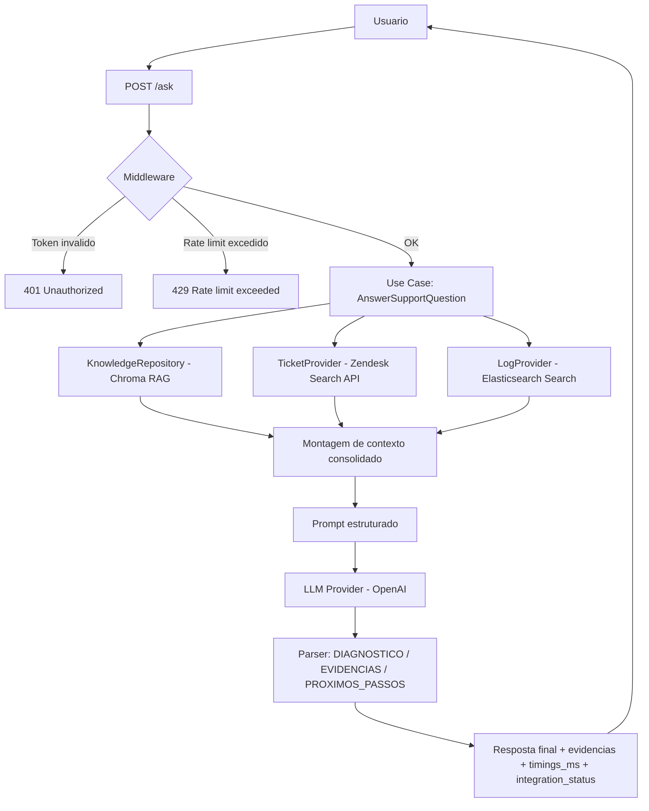

# AI Support Copilot

Copiloto de suporte tecnico com Clean Architecture, RAG, integracao com Zendesk, consulta de logs no Elasticsearch e avaliacao RAG.

Documentacao de engenharia: `docs/`.

## Arquitetura

- `domain`: entidades e contratos (ports)
- `application`: casos de uso
- `infrastructure`: adapters externos (OpenAI, Chroma, Zendesk, Elasticsearch)
- `presentation`: API FastAPI

## Fluxo

1. API recebe pergunta em `/ask`
2. RAG busca contexto na base interna
3. Tickets e logs sao consultados
4. LLM gera diagnostico, evidencias e proximos passos

## Diagrama de fluxo (Mermaid)



## Seguranca e operacao

- Auth por token bearer (`API_AUTH_TOKEN`)
- `REQUIRE_AUTH=true` por padrao
- Rate limit em memoria por IP (`RATE_LIMIT_PER_MINUTE`)
- Logs estruturados com `request_id`
- Timings por etapa (RAG, Zendesk, Elastic, LLM)

## Subir com Docker Compose

1. Copie variaveis:

```bash
cp .env.example .env
```

2. Configure no `.env`:
- `OPENAI_API_KEY`
- `API_AUTH_TOKEN`
- `REQUIRE_AUTH=true`
- `ZENDESK_SUBDOMAIN`, `ZENDESK_EMAIL`, `ZENDESK_API_TOKEN` (opcional)

3. Suba:

```bash
docker compose up --build -d
```

4. Teste:

```bash
curl -X POST "http://127.0.0.1:8000/ask" \
  -H "Authorization: Bearer ${API_AUTH_TOKEN}" \
  -H "Content-Type: application/json" \
  -d "{\"question\":\"Ha backlog de webhook. Qual causa provavel e prioridade?\"}"
```

## Avaliacao RAG

```bash
python evaluation/run_rag_eval.py
```

Metricas:
- `faithfulness`
- `answer_relevancy`
- `context_precision`

## Desenvolvimento local

```bash
python -m venv .venv
.venv\Scripts\activate
pip install -e .[dev]
uvicorn support_copilot.presentation.api.main:app --reload --port 8000
pytest -q
```
