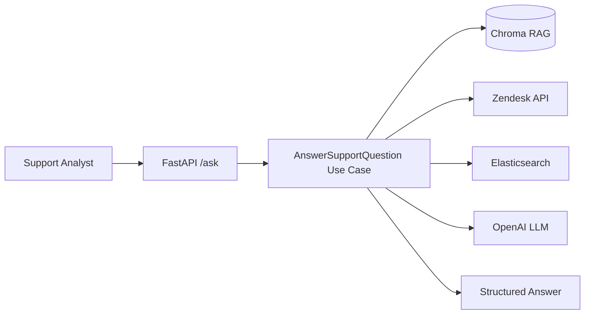

# System Context Diagram

```mermaid
flowchart LR
  U[Support Analyst] --> API[FastAPI /ask]
  API --> UC[AnswerSupportQuestion Use Case]
  UC --> KB[(Chroma RAG)]
  UC --> ZD[Zendesk API]
  UC --> ES[Elasticsearch]
  UC --> LLM[OpenAI LLM]
  UC --> OUT[Structured Answer]
```
